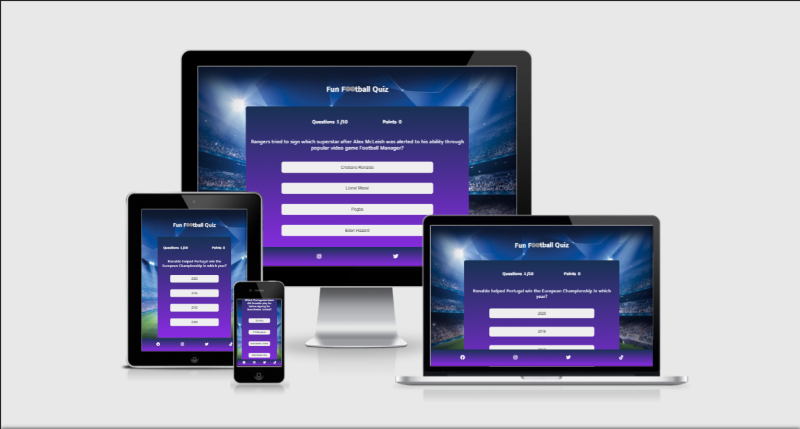

# Fun Football Quiz

## Introduction

Fun Football Quiz is designed to test the knowledge of hard-core football fans who wants to test their knowledge.  
Fun Football Quiz's website offers all the information users need about the quiz. This includes quiz information, starting the quiz, the user's username, how many questions the user has answered, users score points, etc.

Website's live link [Fun Football Quiz](https://hashim222.github.io/Fun-Football-Quiz/)

  
  


## For UX
* For the body, I used an image of a football theme that goes well with the foreground color I have chosen, which is a mixture of these colors (#183153, #892be2) and you can find all the colors I used on the website below in the reference section👇. 

  ### Color Reference:

| RGB             | HEX                                                                |
| ----------------- | ------------------------------------------------------------------ |
| rgb(255, 255, 255) |  #ffffff |
| rgb(240, 248, 255) |  #f0f8ff |
| rgb(0, 0, 0) |  #000000 |
| rgb(24, 49, 83) |  #183153 |
| rgb(137, 43, 226) |  #892be2 |
| rgb(40, 221, 40) |  #28dd28 |
| rgb(255, 45, 45) |  #ff2d2d |

### Font Used:
  The font family used throughout this site is ["Amiko", sans-serif;](https://fonts.google.com/specimen/Amiko)

# Features
* ### A Fun Football Quiz consists of two separate HTML files: a quiz introduction page and the main quiz page
   * The quiz introduction page was created so users can see how the quiz works, how to start the quiz and enter their usernames.

   * Main quiz page contains all the quiz questions and answers.     

## Quiz Introduction Page


* ### Quiz Info
  
  
  * By clicking the Quiz Info button, the user can find out what information they need to know about the quiz.
  * The overlay page will appear when the user clicks on Quiz Info button.

    

  * Once the user clicks the Quiz Info button, they will see this instruction overlay page.
  * Users can find all the necessary details about the quiz on this overlay page.
  * Users can close the page after reading the instructions by clicking the x icon in the top right corner.

* ### Start Quiz
  

  * By clicking on the Start Quiz button, users will be taken to the main quiz page.

* ### Username
  
  * Users can enter their username in the username field, but it's optional.
  * If users wish to begin the quiz without providing their username, they can click on the Start Quiz button and find themselves on the main quiz page.        

     

  * Users will see the text "Username required, please!" if they click the submit button without adding any text.

     

  * Users who enter their username will receive a "thank you! for signing in" message and soon they will be taken to a main quiz page.

 ## Main Quiz Page
   

 * ### Header
    

    * The header is the site's logo, which appears at the top of the page.
    * The quiz questions can be refreshed by either refreshing the page or clicking the header.
    * A user can return to the start of a quiz by clicking the header logo in the middle of the quiz.

 * ### Quiz Question Count
    

   * To help users keep track of the quiz questions, a question count was created.
   * The number of questions will increase as the user answers a question.

 * ### Quiz Points
     

   * Quiz points were created to reward users for answering correctly.
   * Each time the user answers correctly, the number of points will increases to 100.

 * ### Questions And Answers
    
   * The quiz has ten questions in total.
   * In each question, there are four options, so clicking on one takes the user to the next one.
   * The background color will turn green if the user answers correctly, and red if the user answers incorrectly.
      
      
   * After answering all the questions, the user will be taken to the result page.

* ### Users Result Page
   

  * The user can see how many questions they answered correctly and what kind of review they received on the result page.
  * If the correct answers are less than 5, the user will receive a review of "better luck next time!".
  
    
  * If the correct answers are greater than 5 and less than 8, the user will receive a review of "you should try again!".

    

  * If the correct answers are 8 or greater, the user will receive a review of "Well done! You're a real football fan".

    

* ### Home Button And Restart Button
  * By clicking the home button, the user will be taken to the quiz introduction page 

    

  * The user can restart the quiz by clicking the restart button.

    
* ### Footer 
  * Users can follow Fun Football Quiz on these social media platforms: Facebook, Twitter, Instagram, and Tiktok.  

    

## Future Feather
* I would like to save a user's high scores so that the user can play again with the saved high scores.
* I would like to add more than 10 questions to the quiz with different difficulty levels.
* If the user enters the wrong answer, the correct answer will be displayed to them.
## Wireframe
* For the sites wireframe, I used [Wireframe.cc](https://wireframe.cc/).
* You can find websites wireframe inside the [wireframe.md](wireframe.md).
## Testings

*  You can find out what testing has been done for the site, and what bugs were found by visiting [testing.md](testing.md).

## Technologies Used
* These are the technologies that were used to make this project.

  * [HTML](https://en.wikipedia.org/wiki/HTML)
  
  * [CSS](https://en.wikipedia.org/wiki/CSS)

  * [JavaScript](https://en.wikipedia.org/wiki/JavaScript)
  
  * [CDNJS](https://cdnjs.com/libraries/font-awesome) 
  
  * [Font Awesome](https://fontawesome.com/)
  
  * [Google icons](https://fonts.google.com/icons)
  
  * [Google font](https://fonts.google.com/)
  
  * [W3School](https://www.w3schools.com/)

  * [MDN Web Docs](https://developer.mozilla.org/en-US/)
  
  * [AM I RESPONSIVE](http://ami.responsivedesign.is/)
  
  * [Wireframe.cc](https://wireframe.cc/)

  * [Stackoverflow](https://stackoverflow.com/)

  * [git](https://git-scm.com/)

  * [github](https://github.com/)

  * [gitpod workspace](https://gitpod.io/workspaces)

## Deplyoment

* The site was deployed to GitHub pages. Here are the steps:
  * Navigate the Settings tab in the GitHub [repository](https://github.com/hashim222/Fun-Football-Quiz).
  * From the source section drop-down menu, select the Master Branch
  * Once the master branch has been selected, the page will be automatically refreshed with a detailed ribbon display to indicate the successful deployment.  

  You can find the link here [Fun Football Quiz](https://github.com/hashim222/Fun-Football-Quiz)

    

 * ### Clone the project

   * Follow these steps to make a clone of the Fun-Football-Quiz repo:    
    * If the user wants to clone this project, the user needs to locate [Fun Football Quiz repository](https://github.com/hashim222/Fun-Football-Quiz) Code in the dropdown menu and select either download zip or open with Github Desktop.

    

     * A user can copy and paste the link into their git terminal by clicking GitHub CLI and the Copy button in the Code Dropdown menu.
                    
    OR
      ```bash
       gh repo clone hashim222/Fun-Football-Quiz
      ```

    
             
## Credits
  I did not find HTML and CSS too challenging since I had some experience with them and received some assistance from Slack, tutor support and W3school. However, Javascript was quite challenging even though I was familiar with the basics of js before I joined the course. Still, I needed help from outside sources, such as YouTube and Udemy. You can find more information by clicking on the links below 
* ### JS Code
  * The quiz information overlay page was created with a bit of help from W3school.
  * Quiz was created with the help of [Build a Quiz App with HTML, CSS, and JavaScript (Udemy)](https://www.udemy.com/course/build-a-quiz-app-with-html-css-and-javascript/).
  * End bit of main quiz page after user has answerd all the question help was taken from youtube channel [Florin Pop](https://www.youtube.com/channel/UCeU-1X402kT-JlLdAitxSMA).

* ### Content
  * By making this project I had plenty of help from the [Slack Community](https://slack.com/intl/en-gb/).

   * To make a color reference table in the readme, I used [readme.so](https://readme.so/editor).

   * I often look for help on the [StackOverflow community](https://stackoverflow.com/) when I get stuck as well

   *  When a user refreshes the page, the username input field stays focused. This was taken from [LOVE MATHS](https://github.com/Code-Institute-Solutions/love-maths-2.0-sourcecode)

   * The quiz questions and answers were taken from [GOAL Website](https://www.goal.com/en-us).


* ### Media
  * favicon logo was taken from [dreamstime website](https://www.dreamstime.com/flat-football-icon-soccer-ball-vector-illustration-flat-football-icon-soccer-ball-red-circle-image105628452).

  * The websites background image was taken from [wallpapersafari website](https://wallpapersafari.com/w/qJsVwy).
