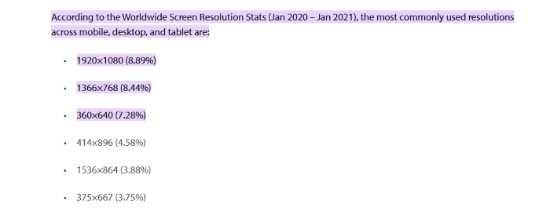
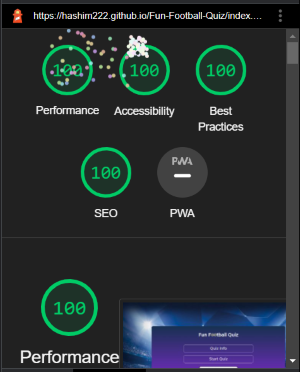
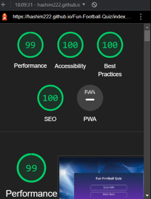
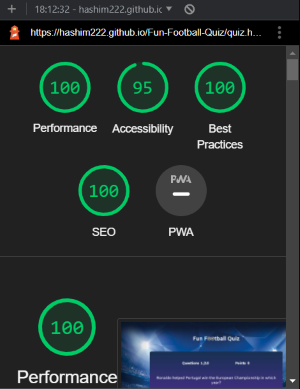
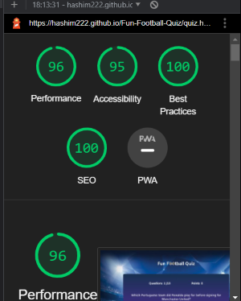

# Testings

* I tested this website on three different browsers: Google Chrome, Microsoft Edge and Firefox.
* The website works perfectly on all the different devices listed at the bottom of the text image.

  
  
### To calculate the site's score, I used Google Chrome developers tools lighthouse.

   * ### [Quiz Info Page For Desktop](assets/images/Readme-Images/desktop-quiz-info.png) 

     

   * ### [Quiz Info Page For Androids](assets/images/Readme-Images/mobile-quiz-info.png) 

     

   * ### [Main Quiz Page For Desktop](assets/images/Readme-Images/desktop-quiz-main.png) 

     

   * ### [Main Quiz Page For Androids](assets/images/Readme-Images/mobile-quiz-main.png) 

     

## Code Validator Testing
 * HTML 

    I confirm that I checked the HTML code by using [W3C HTML Validator](https://validator.w3.org/#validate_by_input) and did not find any errors.    

 * CSS 

    I confirm that I checked the CSS code by using [W3C CSS Validator (Jigsaw)](https://jigsaw.w3.org/css-validator/#validate_by_input) and did not find any errors. 

* JavaScript

   I confirm that I checked the javascript code by using [Jshint](https://jshint.com/) and did not find any errors.
   
 ## Bugs

* ### Bugs Occurred

 
* ### Bugs Fixed

* ### Unfixed Bugs